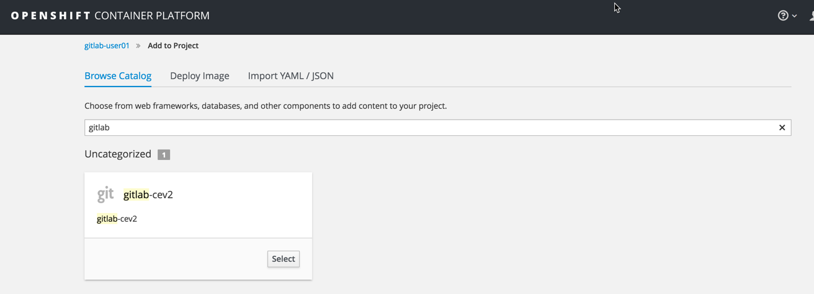
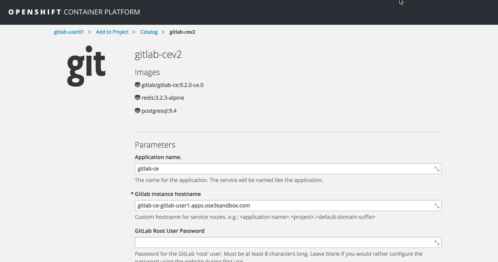
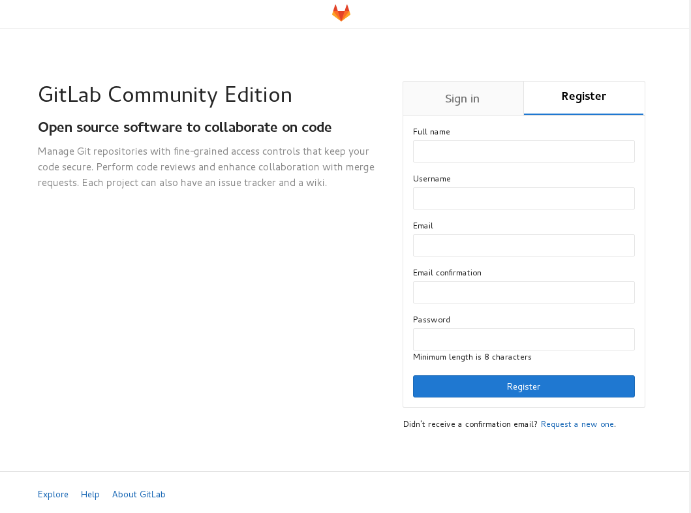
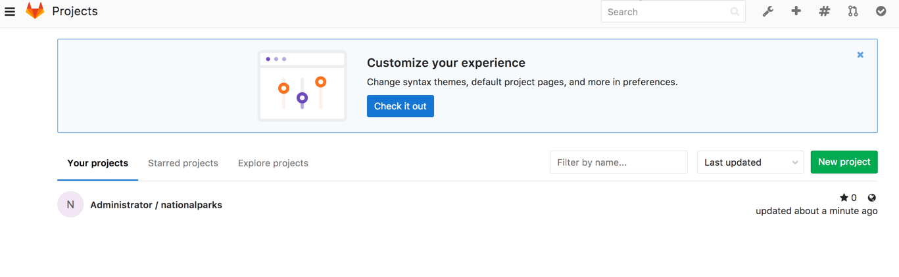

**Lab: GitLab**

This lab sets up a GitLab Community Edition server with MongoDB and Redis backends. It also uses Ansible to provision users and repository.

A GitLab template have been added to the environment in the openshift namespace. You can look at the template here: https://raw.githubusercontent.com/OSE3Sandbox/gitlab-ocp3/master/gitlab.yaml

Create a new project using oc or the OpenShift console.

oc new-project gitlab-USERNAME

Using the OpenShift console, select "Add to Project" and select the gitlab template:

Make sure to specify Gitlab instance hostname which should be the fully qualified name of the GitLab server

Also assign a github root user password.

For example:  gitlab-ce-PROJECTNAME.apps.ose3sandbox.com

Wait for all the containers to start. Once they are all started, access our gitlab through a web browser.

You should see :

Create a new account.  You can also login as root, using any password ... Very secure :)  

The next part of this lab is using Ansible.
If you don't have Ansible install on your machine, please follow the instructions described here:
* (Ansible Installation)[http://docs.ansible.com/ansible/intro_installation.html]

In your local copy of your github repository, edit the gitlab_repo playbook:  ansible/gitlab_repo.yaml and set the variables for your GitLab environment.

This playbook will clone an existing repository into your GitLab installation.

to execute the playbook:

ansible-playbook ansible/gitlab_repo.yaml

Login to the gitlab console.

You should see the project:

