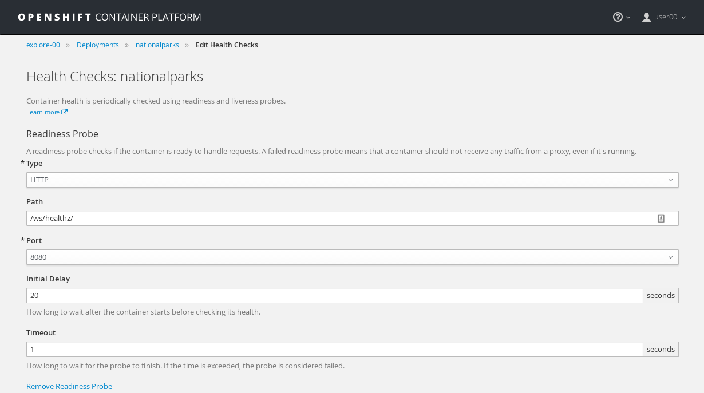
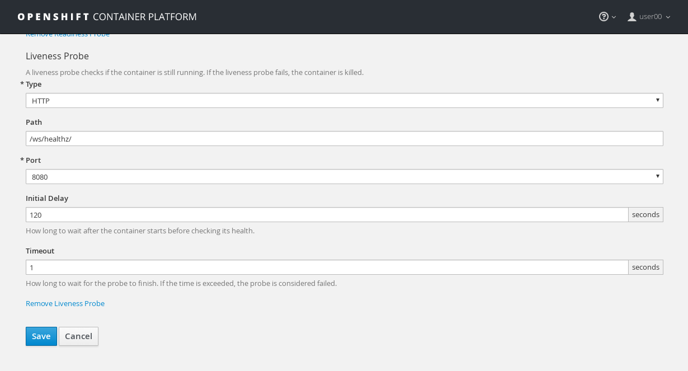
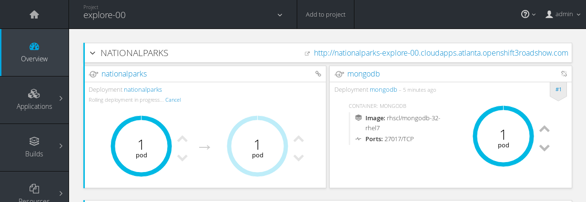

As we have seen before in the UI via warnings, there is a concept of application health checks in OpenShift. These come in two flavors:

  - Readiness probe

  - Liveness probe

From the Application Health section of the documentation, we see the definitions:

**Liveness Probe**
A liveness probe checks if the container in which it is configured is still running. If the liveness probe fails, the kubelet kills the container, which will be subjected to its restart policy. Set a liveness check by configuring the template.spec.containers.livenessprobe stanza of a pod configuration.

**Readiness Probe**
A readiness probe determines if a container is ready to service requests. If the readiness probe fails a container, the endpoints controller ensures the container has its IP address removed from the endpoints of all services. A readiness probe can be used to signal to the endpoints controller that even though a container is running, it should not receive any traffic from a proxy. Set a readiness check by configuring the template.spec.containers.readinessprobe stanza of a pod configuration.

It sounds complicated, but it really isn’t. We will use the web console to add these probes to myjobbossapp, previously deployed

We are going to add both a readiness and liveness probe to the existing myjbossapp deployment. This will ensure that OpenShift does not add any instances to the service until they pass the readiness checks, and will ensure that unhealthy instances are restarted (if they fail the liveness checks)

Click **Applications → Deployments** on the left-side bar. Click ks. You will see the warning about health checks, with a link to click in order to add them. Click **Add health checks** now.

 You will want to click both **Add Readiness Probe** and **Add Liveness Probe** and then fill them out as follows:

 Readiness Probe

   - Path: /ws/healthz/

   - Initial Delay: 20

   - Timeout: 1

 

 Liveness Probe

   - Path: /ws/healthz/

   - Initial Delay: 120

   - Timeout: 1

 

 Click **Save** and then click the **Overview** button in the left navigation. You will notice that these changes caused a new deployment — they counted as a configuration change.

You will also notice that the circle around the new deployment stays light blue for a while. This is a sign that the pod(s) have not yet passed their readiness checks — it’s working!

 
