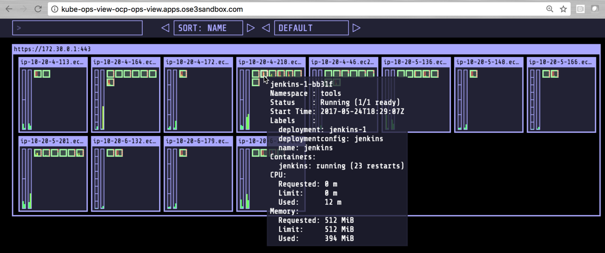

## Management Tools ##

OpenShift includes several monitoring tools. Furthermore, Kubernetes have a rich ecosystem that can be leveraged to provide additional capabilities.


***Cockpit***

Your environment was installed with Cockpit. Cockpit is a system administration tool that provides a user interface for monitoring and administering servers through a web browser.

Using Cockpit, you can monitor resource utilization and OpenShift resources such as Volumes, Pods, Images, Topology.

To login to Cockpit, go to the URL that was provided to you. Typically, Cockpit listen on port 9090 on the same host as your OpenShift master.


***CloudForms***

***Hawkular***

***EFK***

***Community Tools***

Several community and 3rd party tools are available to monitor OpenShift. In this lab we will install Kube-Ops-View a read only open source system dashboard.

To install Kube-Ops-View, follow this procedure:

```
oc new-project ocp-ops-view
oc create sa kube-ops-view
oc adm policy add-cluster-role-to-user cluster-admin system:serviceaccount:ocp-ops-view:kube-ops-view
oc apply -f https://raw.githubusercontent.com/raffaelespazzoli/kube-ops-view/ocp/deploy-openshift/kube-ops-view.yaml
oc expose svc kube-ops-view
```


