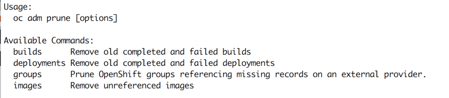

## Pruning

Over time, objects created in OpenShift can accumulate in the etcd data store through normal user operations, such as when building and deploying applications.

As an administrator, you should periodically prune older versions of objects from your OpenShift instance that are no longer needed. For example, by pruning images you can delete older images and layers that are no longer in use, but are still taking up disk space.

This simple lab will show how to prune unused resources and versions.

To prune objects, the following command is used:

```
oc adm prune
```




Several options are available, experiment with the command to discover options and parameters.

For more information:

[Click here for additional information on the pruning options](https://docs.openshift.com/container-platform/3.5/admin_guide/pruning_resources.html)
