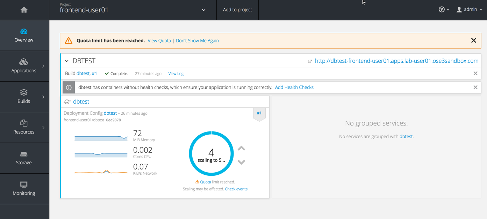
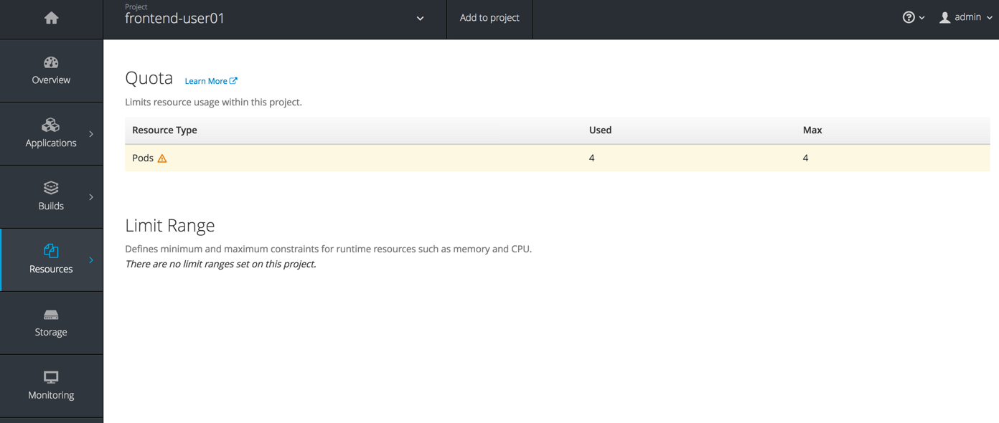
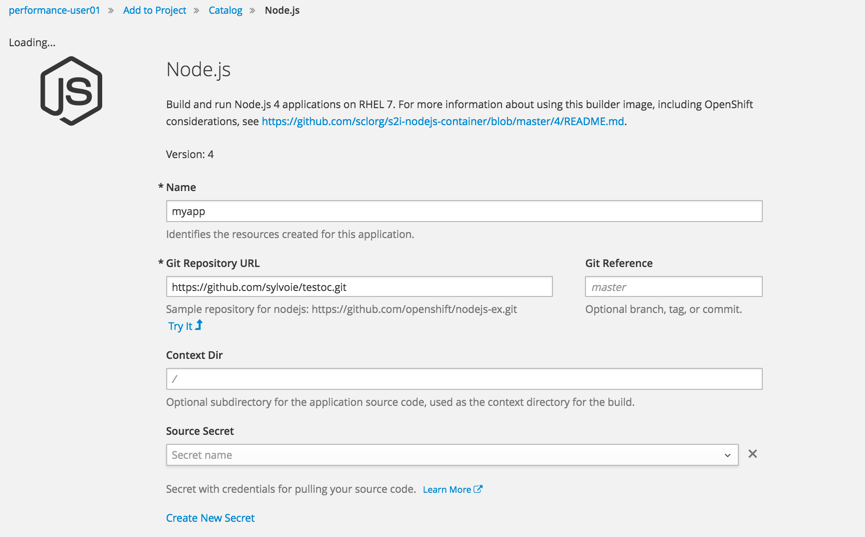
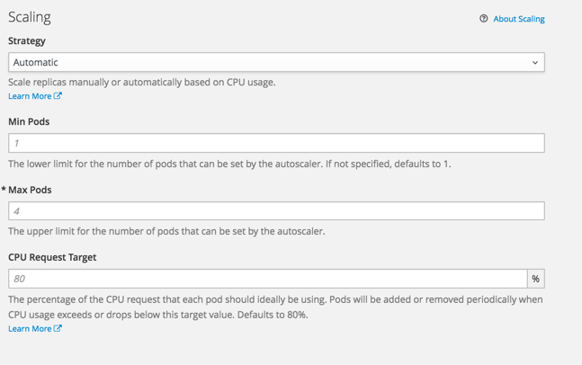
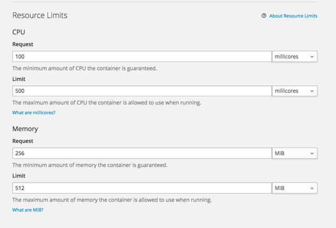
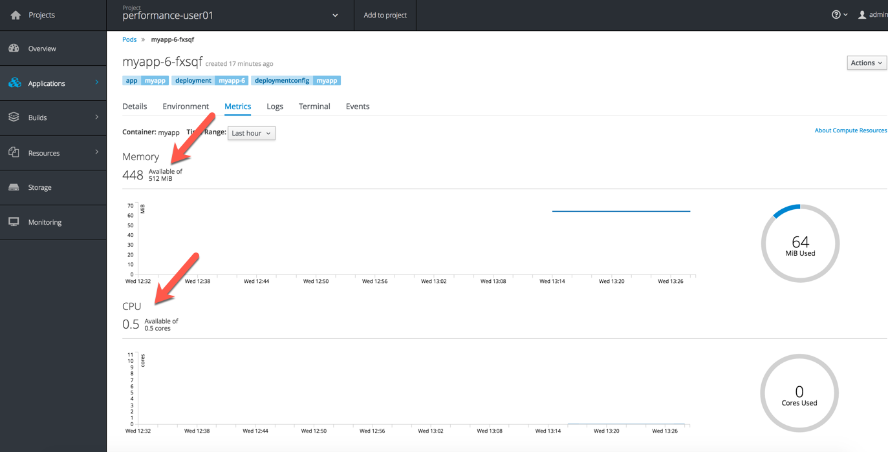
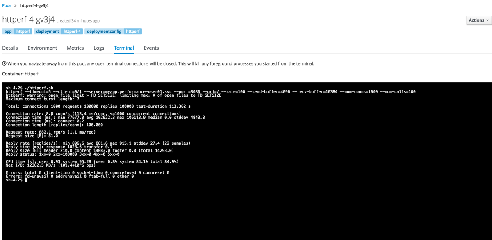
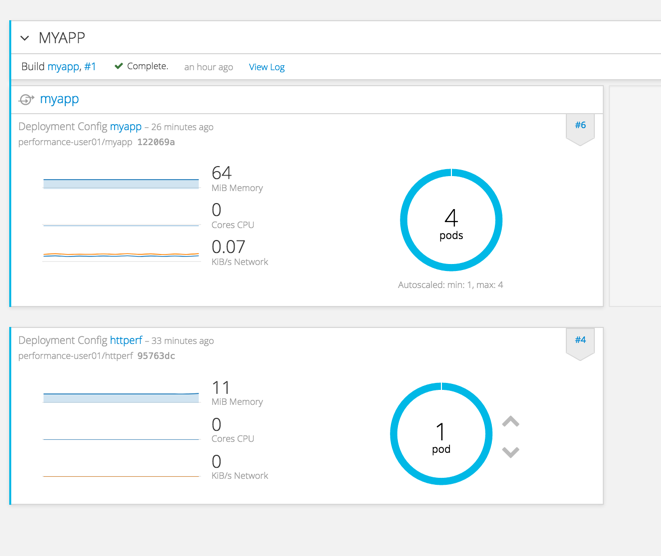
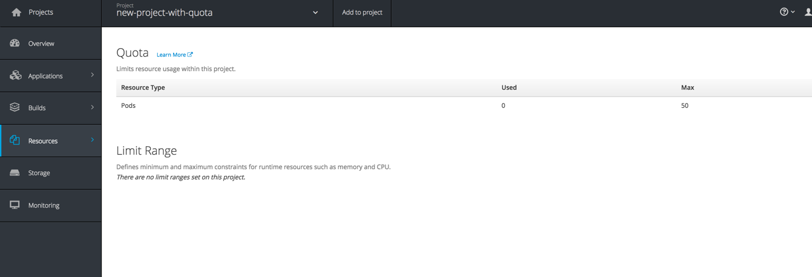

## Quotas and Limits

A resource quota, defined by a ResourceQuota object, provides constraints that limit aggregate resource consumption per project. It can limit the quantity of objects that can be created in a project by type, as well as the total amount of compute resources and storage that may be consumed by resources in that project.

It can be used for resource protection, capacity platform and governance of the environment.

In this lab, we will create a simple resource quota in the frontend project.


#### Step 1 - Apply Resource Quota

To create a quota, create a file (quota.yml) with the following content:


```
apiVersion: v1
kind: ResourceQuota
metadata:
  name: compute-resources
spec:
  hard:
    pods: "4"

```

This quota puts a hard limit of 4 on the number of pods that can be created. Quota can be applied on the majority of OpenShift resources.

To apply this quota, make sure you are in the frontend project:
```
oc project frontend-user01
```
and create the quota:
```
oc create -f quota.yml
```
In the UI, navigate to your frontend project. Using the arrows next to the POD counter, scale the deployment of the PHP application to 5 pods.

You should see the following screen:



The application will scale to 4 pods and display a message.
You can look at the quota:




#### Step 2 - Apply Resource Limits

In this lab, we will apply resource limits on a pod.
Create a new project using the UI or the command line.

```
oc new-project myperf-user01
```
In the Web Console, Click on **Add to Project**.
Add a JavaScript/Node.js application.

Use the following parameters:
Name: myapp
Git URL: https://github.com/sylvoie/testoc

Expand the **Advanced Options**



**Set the following scaling options:**

```
Scaling Mode: Automatic
Min Pod: 1
Max Pod: 4
CPU Target: 80%
```




**Set the following resource limits:**

```
CPU request: 100
CPU limit: 500

MEM request: 256 MiB
MEM limit: 512 MiB
```



**Create the application**

Navigate to the pod and open the "Metrics" tab in the UI.
The resource utilization is capped.




#### Step 3- Apply project level limit and quota

In this section, we will create a complete example of a project using limits and quotas. Limits are applied to resource consumption and resource request, quotas are applied to the number of objects that can be created.

Create a new project:

```
oc create myapp-dev
```

in that project, create a resource limits and resource quota using the following files:

* [Limits file](limits.yaml)

* [Quota file](Quota.yaml)


```
oc create -f https://raw.githubusercontent.com/OSE3Sandbox/openshiftv3-workshop/master/limits.yaml
```
```
oc create -f  https://github.com/OSE3Sandbox/openshiftv3-workshop/blob/master/quota.yaml
```

Create the application:

```
oc new-app docker.io/openshift/hello-openshift:v1.4.1
```

In the OpenShift UI, observe the quotas and limits for the myapp-dev project.


#### Step 4 (Optional) - Performance test

This step is optional. You will see how OpenShift autoscale applications and respond to additional load. Limits and scaling maximums will be enforced to protect the other applications and tenants of the platform.

**Deploy the load testing container**

In this step, we will deploy a container with Centos and HTTperf (an open source load testing tool) installed.

To deploy this container, from the command line use the following command:

```
oc new-app https://github.com/OSE3Sandbox/httperf
```

In the OpenShift UI, wait for the httperf container to deploy and go to the httperf pod terminal.

In the home directory, edit the httperf.sh file to configure the endpoint specific to your deployment (myapp.performance-user01.svc).
Start the performance test by executing the script: ./httperf.sh
The script will output the results when completed.



In another browser window, you can monitor the behaviour of OpenShift (metrics, autoscale).



#### Step 5 - Apply Quota automatically to new projects

In this lab, we will learn how to apply automatically a quota when a new project is created.

OpenShift automatically provisions projects based on the template that is identified by the projectRequestTemplate parameter of the master-config.yaml file. If the parameter is not defined, the API server creates a default template that creates a project with the requested name, and assigns the requesting user to the "admin" role for that project.

***Create a project template***

On the OpenShift server export the default project template to a file:

```
oadm create-bootstrap-project-template -o yaml > template.yaml
```

Edit the template.yaml to add the following section under the "objects:" section

```
- apiVersion: v1
  kind: ResourceQuota
  metadata:
    name: compute-resources
  spec:
    hard:
      pods: "50"
```

Be careful when editing YAML file. Spaces and indentation must be preserved. Tabs are not allowed.

Save the file

Import the template in the OpenShift server:

```
oc create -f template.yaml -n default
```

We need to modify the OpenShift configuration file to use this new project template as the default. This operation must be performed as root. On the OpenShift server:

```
sudo -i
cd /etc/origin/master/
cp master-config.yaml master-config.yaml.backup
```

Edit the master-config.yaml. Locate the projectRequestTemplate attribute and change to:

```
  projectRequestTemplate: "default/project-request"
```

Again, it is YAML, be careful about spaces and indentation.

Restart the OpenShift master:

```
systemctl restart atomic-openshift-master
```

In the OpenShift console, create a new project.
Navigate to the Resources->Quota.


