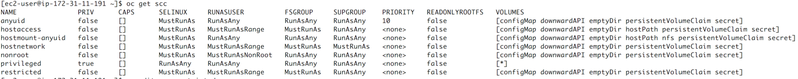
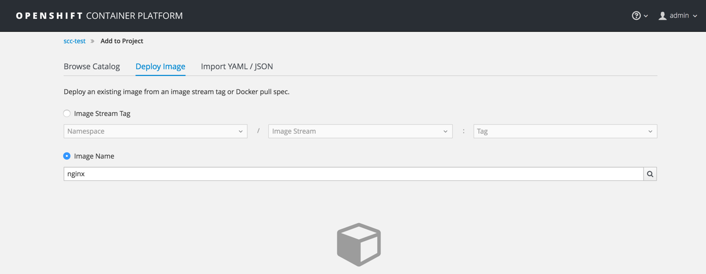
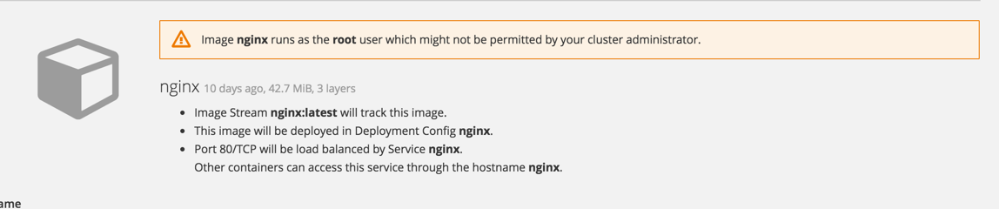
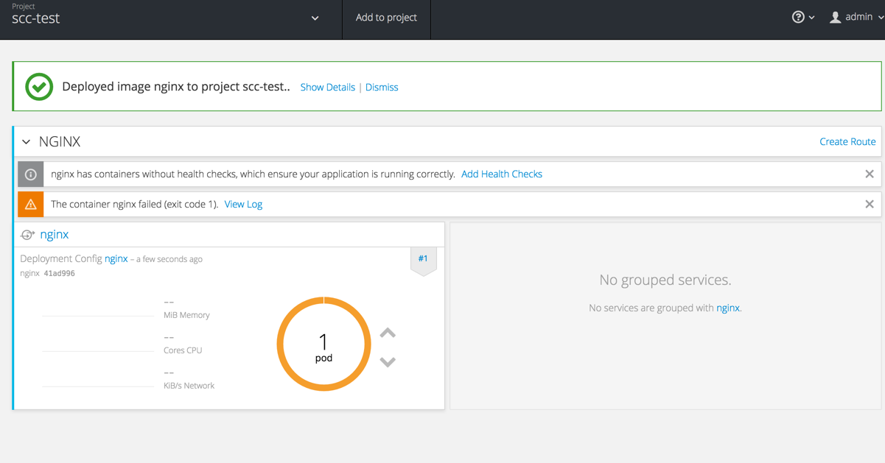
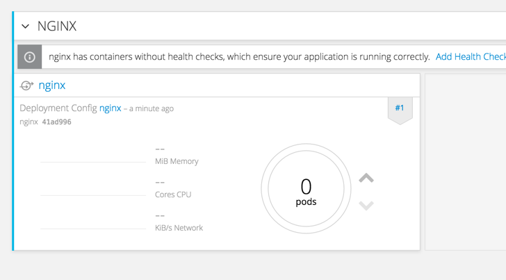

# Security Contexts

OpenShift provides security context constraints (SCC) that control the actions that a pod can perform and what it has the ability to access.
We a container is executed, we want to guarantee that the capabilities required by that container to run are satisfied, while at the same time keeping OpenShift secured.

Under normal circumstances, most containers should not be allowed to get access to unnecessary capabilities or to run in an insecure way (e.g. privileged or as root).

```
oc get scc
```

Will display the list of available SCC in your system.



You can edit and change the existing SCC or create a new one to modify the behaviour of your OpenShift installation. In most situation, creating a new SCC is preferable to modifying the default ones to prevent problems during upgrades or new versions.

To edit a SCC:

```
oc edit scc SCC_NAME
```

##### Step 1 Create a Project

Create a new project using the OpenShift UI or the command line.

```
oc new-project scc-test
```

Navigate to the project in the OpenShift UI
Click on ****Add to Project****
Add the nginx default image from Docker Hub to the project:



OpenShift should give you a warning




Create the container.

The container should fail to deploy



Scale down the container deployment to 0



On the command line, go to the scc-test project:

```
oc project scc-test
```

Add the anyuid SCC to the service account running the container.

```
oc adm policy add-scc-to-user anyuid -z default
```

This command adds the default service account in the current project (-z) to the anyuid SCC.

'''
oc describe scc anyuid
'''

Scale your deployment to 1 and observe the result.
