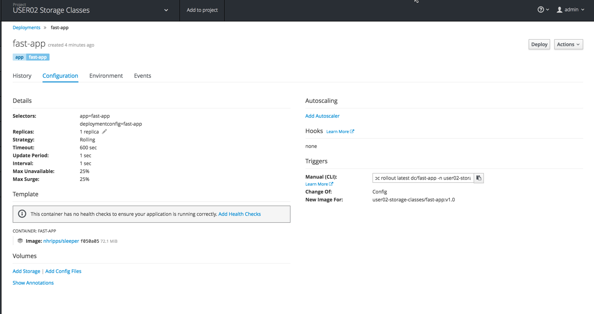
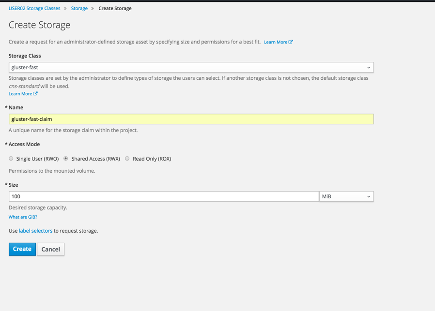
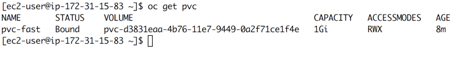

## Managing storage

The files for this lab are located here: https://github.com/OSE3Sandbox/files


In previous versions, OpenShift was using PV/PVC method to provision storage. A PV (Persistent Volume) resource is a representation of a storage resource (NFS, Gluster, EBS, Fiber...) in the OpenShift Cluster.  A PVC (Persistent Volume Claim) is a request for storage with specific attribute.

Introduced in OpenShift 3.4, Storage Classes are a way of setting up persistent storage that offers more flexibility and control than the simple PV / PVC options.

Storage classes are resource objects that describe and classify storage that can be requested.

One of the primary features of Storage Classes is that they can be used to provide storage that is dynamically provisioned. This is explained in detail  in [our docs](https://docs.openshift.com/container-platform/latest/install_config/persistent_storage/dynamically_provisioning_pvs.html#install-config-persistent-storage-dynamically-provisioning-pvs) , and dynamic provisioning is supported for:

* OpenStack Cinder
* AWS EBS
* GCE PersistentDisk
* GlusterFS
* Ceph RBD

In this lab, we will be using GlusterFS or AWS EBS - confirm your installation with the instructor.

#### Lab Scenario

We’ve defined two storage classes to simulate two different types of storage:
* “fast-storage”  will be our placeholder for a high I/O speed storage option (SSD-based, for instance)
* "slow-storage” will be our placeholder for a slower I/O speed storage option (like rotational-media old school hard drive storage)

We are going to deploy two applications into a new namespace. We will provision the fast storage to one of the apps and slow storage to the other.

The storage scenario is implemented with the same type of storage, in a real life scenario, we would use different storage provider

##### Step 1 - Create Storage Classes

Look at one of the storage class (fast-aws-storageclass.yaml for example):

<Strong> IMPORTANT, AWS EBS storage is pinned to an AWS zone, you must change the storage to map to the region where your nodes are deployed</Strong>

```
kind: StorageClass
apiVersion: storage.k8s.io/v1beta1
metadata:
  name: fast-storage
provisioner: kubernetes.io/aws-ebs
parameters:
  type: gp2
  zone: ca-central-1a
```

The yaml file defines the type of storage to be used, the location and the name of the storage class.

To create a storage class, login to the OpenShift server using the oc cli and a user with cluster-admin privilege:

* oc login

* oc create -f STORAGE_CLASS_FILE


* oc get storageclasses

The output should look like:

```
NAME                     TYPE
standard (default)       kubernetes.io/glusterfs
gluster-fast             kubernetes.io/glusterfs
gluster-slow             kubernetes.io/glusterfs
```


In this environment, standard is set as the default storage class. The default storage class is use when no specific type of storage is requested.

Look at each storage class:

* oc describe storageclass standard

```
storageclass.beta.kubernetes.io/is-default-class=true
```

Is the annotation used to define a default class.


##### Step 2 - Create project and application

Create a new project to deploy applications using these storage classes:

```
oc new-project userXX-storage-classes --display-name='userXX Storage Classes'
```

Deploy the demo application in your newly created project:

```
oc new-app docker.io/nhripps/sleeper:v1.0 --name=fast-app
```

###### Choose between 3a and 3b:

##### Step 3a - Create PVC using the CLI.

You can either create the PVC from the command line or directly in the OpenShift User Interface.

<strong> If you choose to create using the UI, please skip this step. </strong>

To create from the command line, look at the fast-pvc.yaml file:

```
apiVersion: v1
kind: PersistentVolumeClaim
metadata:
  name: fast-pvc
  annotations:
    volume.beta.kubernetes.io/storage-class: fast-storage
spec:
  accessModes:
  - ReadWriteOnce
  resources:
    requests:
      storage: 100Mi
```


The annotation:     volume.beta.kubernetes.io/storage-class: fast-storage
 is used to select the desired storage type.

* oc create -f fast-pvc.yml  


#### Step 3b - Create PVC from the UI
Select your storage project in the OpenShift UI

In the left-hand navigation panel, click the Storage tab. Here you should see the PersistentVolumeClaim that you have created. It should be bound to an AWS Volume.


##### Step 4 - Attach storage to your application

In this step, we will attach persistent storage to our application.

* Using the OpenShift UI, navigate to the storage project. Use the left-hand navigation panel to go to: Applications => Deployments. You should see the ‘fast-app’ Deployment. Click into ‘fast-app’ to see a summary of the Deployment configuration.




* In the Template section of this Deployment summary page, find the Volumes heading and the ‘Add storage’ link below it. Click this link to move to the ‘Add Storage’ view.

* In the ‘Add Storage’ view:
    * You should see that you can choose which PersistentVolumeClaim to use for this deployment. If you have done Step 3, use your ‘pvc-gluster-fast’ storage claim. If not, create one with the following attributes:



* In the next screen, Under the ‘Volume’ heading, set the value of ‘Mount Path’ to /mountpoint. This is an existing directory path inside of the container that will become a mount point in the container for our Gluster volume.

* Press the ‘Add’ button to apply this change

* You should be looking at the Deployment summary page again. Under the ‘Volumes’ heading, you should see an entry for the volume that you just added.

##### Step 5 - Validate persistence of data

* Using the left-hand navigation panel, now go to Applications => Pods. You should see at least one pod with a name like ‘fast-app-2-.....`. Click on this pod to switch into the Pod summary view.

* Click on the terminal tab. You will be connected to the running pod and presented with a shell.

* In the shell, type:
   * echo fast >/mountpoint/fast.txt

* In the CLI, delete your pod:

```
oc get pods

oc delete pod fast-app-xXXX

```

* OpenShift will restart your application automatically
* if you look in the newly created pod, your fast.txt file should be there.

If using AWS, you can find your data by following this procedure:

* oc get pvc



Your volume id is in the VOLUME field.
On the OpenShift host, go to:

* cd /var/lib/origin/openshift.local.volumes/pods

OpenShift assigned a triplet key volume owner tag to organize the folder internally.

From that location, you should be able to find your volume id directory.

```
find . -name pvc-d3831eaa-4b76-11e7-9449-0a2f71ce1f4e
```
