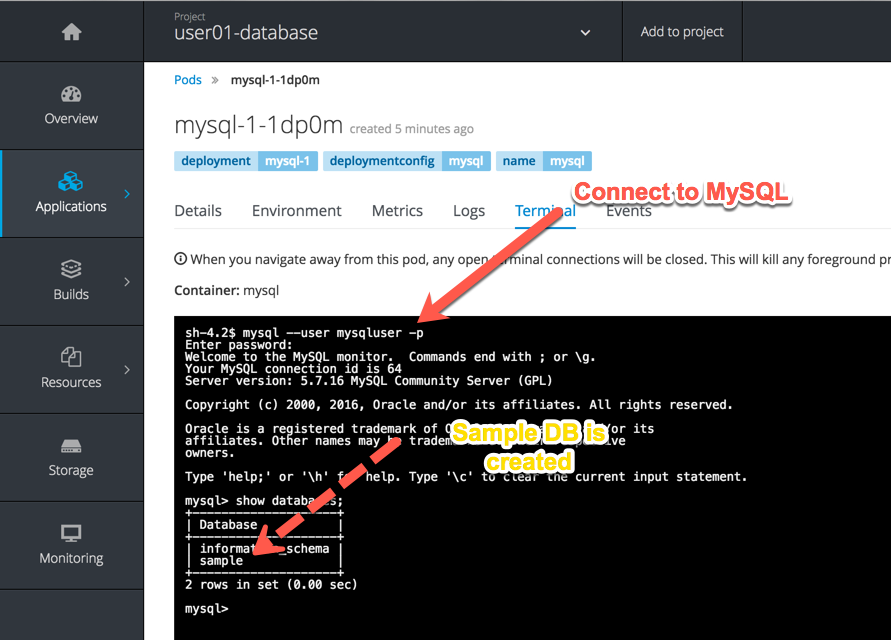
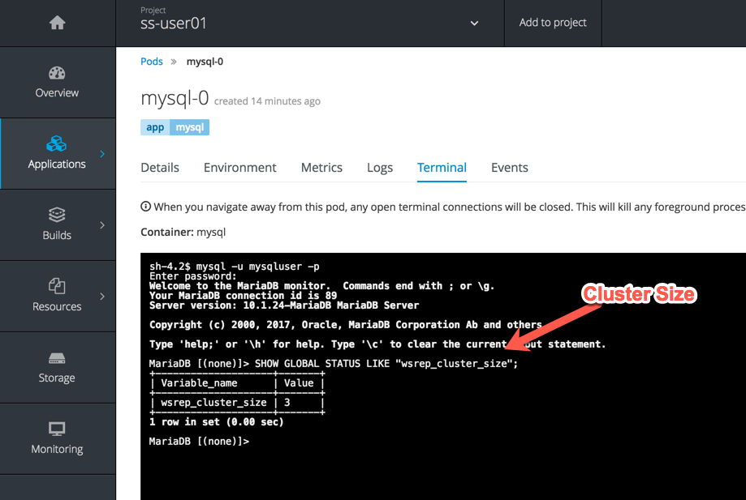

## Using Databases

In this lab exercise we will learn how to use OpenShift Web Console to spin up a MySQL database using templates.

**Step 1: Create a Project**

Based on the experience gained from the previous exercise, log into the OpenShift Web Console. You will see the list of Projects.

Using the **New Project** button, create a new project. We will call it **UserXX-database**. Replace by your username to make this project unique. Type in a **Display Name** and **Description** of your choice.

Press the **Create** button to complete the project creation from the Web Console. This will accomplish the same job as `oc new-project` from CLI.

**Step 2: Create a MYSQL database using the template**

Click on **Add to Project** button and you will be taken to select an image or template. You will see the application create screen as shown below:


Scroll down and click on **Data Stores** session. Find **MySQL (Persistent)** template from the list and click **Select**.

You will be taken to the mysql  creation screen. Click edit parameters and edit the values to use the following values:

```
Database Service Name: mysql
MySQL Connection Username: mysqluser
MySQL Connection Password: supersecret
MySQL Database Name: sample
```

This will create several OpenShift resources:
* A pod running the MySql Database
* A service to connect to that Database
* A PersistentVolumeClaim using the Storage Class to provision storage

You can connect to your database in the terminal tab of the MySQL pod in the UI:




All this is great, but the Database is not really able to scale. Scaling the database pods will essentially create two independent instances of my SQL.

How to address this ?


## Introducing Stateful Sets ##

StatefulSets is an API thought for running stateful applications and services on top of OpenShift/Kubernetes. It was introduced as an Alpha Feature in Kubernetes v1.3 and beta in Kubernetes 1.5 It became available in OpenShift starting with v3.3. Because of the architecture of Kubernetes it was, up to now, not easy to run stateful services and applications on top of it, but first ideas for so called “nominal services” were proposed early on, but were not realized because of other priorities.

The addition of StatefulSets provides a solution that is tailored for the requirements of stateful applications and services. Pods in a StatefulSet receive a unique identity and numeric index (e.g. app-0, app-1, …) which is consistent over the lifetime of the pod

<p>To run MariaDB  Cluster on your own OpenShift infrastructure you&#8217;ll need to first clone the following <a href="https://github.com/OSE3Sandbox/openshift-mariadb-galera">openshift-mariadb-galera repository on Github</a>:</p>
<pre><code>git clone https://github.com/OSE3Sandbox/openshift-mariadb-galera.git
</code></pre>
<p>Enter the cloned repository and you&#8217;ll see all the the YAML definitions used for deploying MariaDB Galera Cluster on OpenShift.
<p>Create a project and start the StatefulSet using:</p>
<pre><code>oc new-project userxx-stateful</code></pre>
<pre><code>oc new-app -f mariadb-galera-persistent-template.yml -p MYSQL_USER=mysqluser -p MYSQL_PASSWORD=supersecret -p MYSQL_DATABASE=sample -p MYSQL_ROOT_PASSWORD=supersecret
</code></pre>
<p>Now you should see pods with the names mysql-0, mysql-1 and mysql-2 appear in the WebUI, and when running <code>oc get pod -w</code>, one after another and in the logs of mysql-0 you&#8217;ll see the other nodes join the cluster one at a time. Here&#8217;s an excerpt from the logs when mysql-2 joined the cluster</p>
<pre><code>2016-12-14 10:53:56 139884039759616 [Note] WSREP: Member 2.0 (mysql-2) requested state transfer from '*any*'. Selected 0.0 (mysql-0)(SYNCED) as donor.
2016-12-14 10:53:56 139884039759616 [Note] WSREP: Shifting SYNCED -&gt; DONOR/DESYNCED (TO: 0)
2016-12-14 10:53:56 139883309950720 [Note] WSREP: Running: 'wsrep_sst_xtrabackup-v2 --role 'donor' --address 'mysql-2.galera.default.svc.cluster.local:4444/xtrabackup_sst//1' --socket '/var/lib/mysql/mysql.sock' --datadir '/var/lib/mysql/'  --defaults-extra-file '/etc/mysql/my-galera.cnf'   '' --gtid '6efedc62-c1eb-11e6-aa88-caa42e8a4bf5:0' --gtid-domain-id '0''
2016-12-14 10:53:56 139884364667648 [Note] WSREP: sst_donor_thread signaled with 0
2016-12-14 10:53:57 139884048152320 [Note] WSREP: (605ee840, 'tcp://0.0.0.0:4567') turning message relay requesting off
WSREP_SST: [INFO] Streaming with xbstream (20161214 10:53:57.285)
WSREP_SST: [INFO] Using socat as streamer (20161214 10:53:57.294)
WSREP_SST: [INFO] Using /tmp/tmp.VPV4JTPiMJ as xtrabackup temporary directory (20161214 10:53:57.328)
WSREP_SST: [INFO] Using /tmp/tmp.FaKIQIPmur as innobackupex temporary directory (20161214 10:53:57.333)
WSREP_SST: [INFO] Streaming GTID file before SST (20161214 10:53:57.343)
WSREP_SST: [INFO] Evaluating xbstream -c ${INFO_FILE} | socat -u stdio TCP:mysql-2.galera.default.svc.cluster.local:4444; RC=( ${PIPESTATUS[@]} ) (20161214 10:53:57.347)
WSREP_SST: [INFO] Sleeping before data transfer for SST (20161214 10:53:57.356)
WSREP_SST: [INFO] Streaming the backup to joiner at mysql-2.galera.default.svc.cluster.local 4444 (20161214 10:54:07.366)
WSREP_SST: [INFO] Evaluating innobackupex  --defaults-extra-file=/etc/mysql/my-galera.cnf --no-version-check  $tmpopts $INNOEXTRA --galera-info --stream=$sfmt $itmpdir 2&gt;${DATA}/innobackup.backup.log | socat -u stdio TCP:mysql-2.galera.default.svc.cluster.local:4444; RC=( ${PIPESTATUS[@]} ) (20161214 10:54:07.374)
2016-12-14 10:54:11 139884039759616 [Note] WSREP: 0.0 (mysql-0): State transfer to 2.0 (mysql-2) complete.
2016-12-14 10:54:11 139884039759616 [Note] WSREP: Shifting DONOR/DESYNCED -&gt; JOINED (TO: 0)
2016-12-14 10:54:11 139884039759616 [Note] WSREP: Member 0.0 (mysql-0) synced with group.
2016-12-14 10:54:11 139884039759616 [Note] WSREP: Shifting JOINED -&gt; SYNCED (TO: 0)
2016-12-14 10:54:11 139884364667648 [Note] WSREP: Synchronized with group, ready for connections
WSREP_SST: [INFO] Total time on donor: 0 seconds (20161214 10:54:11.231)
WSREP_SST: [INFO] Cleaning up temporary directories (20161214 10:54:11.241)
2016-12-14 10:54:15 139884039759616 [Note] WSREP: 2.0 (mysql-2): State transfer from 0.0 (mysql-0) complete.
2016-12-14 10:54:15 139884039759616 [Note] WSREP: Member 2.0 (mysql-2) synced with group.
</code></pre>

<p>After all the pods have been started you should be able to log in to MySQL and get the cluster size:</p>


<br/>


<h2>Links</h2>
<ul>
<li><a href="https://kubernetes.io/docs/concepts/workloads/controllers/petset/">Kubernetes StatefulSet Documentation</a></li>
<li><a href="http://kubernetes.io/docs/user-guide/pods/init-container/">Kubernetes Init Container Documentation</a></li>
<li><a href="https://mariadb.com/kb/en/mariadb/what-is-mariadb-galera-cluster/">MariaDB Galera Cluster &#8211; What is MariaDB Galera Cluster?</a></li>
</ul>
