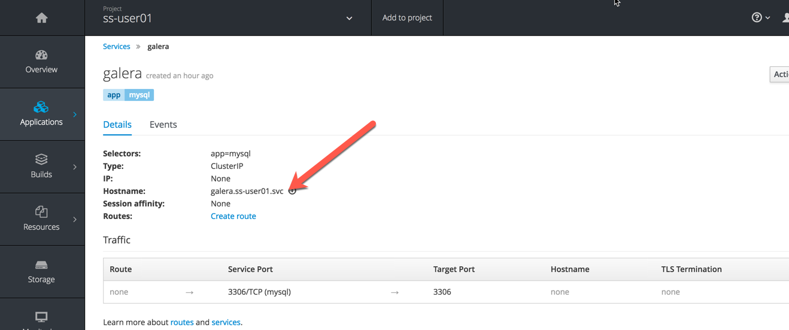

## Lab: Add a PHP frontend to get data from a database ##

In this step we will add a PHP frontend application that talks to recently created database.

Before we start, you will need the Fully Qualified Domain Name (FQDN) of your database service. To get that FQDN, go to your StatefulSet project and click on the galera service:



The FQDN should look like:  galera.ss-user01.svc

###### Back to the frontend....

The code is available on github to use at https://github.com/masauve/dbtest.
Browse through the code in this repository. It has a simple php file (`dbtest.php`) that connects to the database and reads the values from the users table and displays them.

Create a new project in OpenShift using the UI or the command line:
* oc new-project userXX-frontend

To add a frontend, in the useXX-frontend project, click on **Add to Project** to spin up a frontend application. It takes you to select image or template page and choose the **PHP** template under PHP apps. Use the 5.6 version.


```
* Name: dbtest
* Git Repository URL: https://github.com/masauve/dbtest
```
Click onto the link <strong>"Show advanced options"</strong>, go to Deployment Configuration section and enter the following environment variables:


Enter the following values for each parameters:


Create the application

When the application is up and running, click on the route. After a few seconds, you should see the following:


If you look at the pod log screen, you should eventually see the following:


Why ?   The answer is in the next lab!
