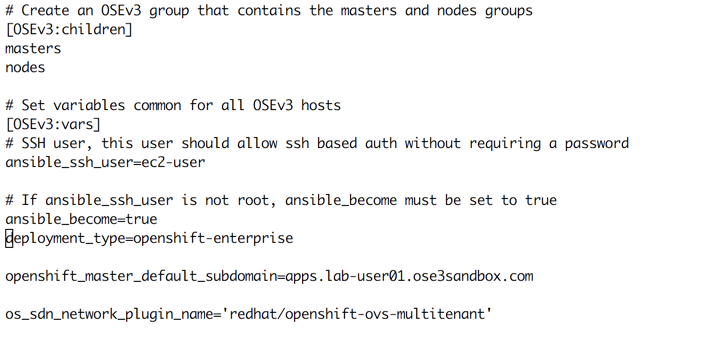
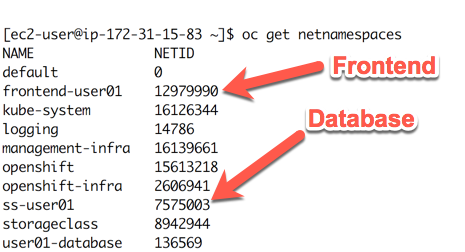
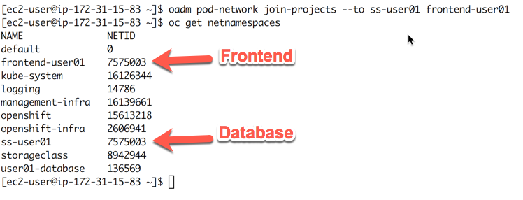

## Multi Tenant Networking

The ovs-multitenant plug-in provides OpenShift Container Platform project level isolation for pods and services. Each project receives a unique Virtual Network ID (VNID) that identifies traffic from pods assigned to the project. Pods from different projects cannot send packets to or receive packets from pods and services of a different project.

However, projects which receive VNID 0 are more privileged in that they are allowed to communicate with all other pods, and all other pods can communicate with them. In OpenShift Container Platform clusters, the default project has VNID 0. This facilitates certain services like the load balancer, etc. to communicate with all other pods in the cluster and vice versa.

The OpenShift instance you are using was configured using Ansible. The network type is defined in the Ansible inventory:

#### Step 1 - Network Namespaces

to look at the network namespaces currently assigned by OpenShift, use the following command:

* oc get netnamespaces

As you can see in that example, the Frontend and the Database of our projects are on different VNID. Traffic is blocked between the projects.

To join the projects at the network level, use the following command:

* oc adm pod-network join-projects --to ss-user01 frontend-user01

After executing that command, the two projects should be on the same network VNID:

###### You can now try the frontend application again!
