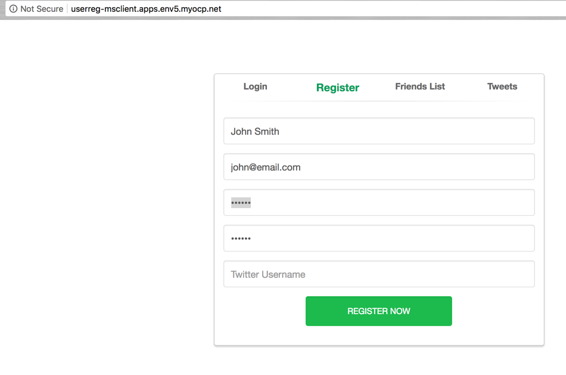

## Network Policy Networking

OpenShift can be configured to use several network configuration:
1) subnet - a flat network across all projects
2) multitenant - a coarse-grained network where each project is assigned a VNID. Only pods within the same VNID can communicate with each others on the internal OpenShift network.
3) network policy - a fine-grained control on the network flow.

The ovs-netorkpolicy network is configured in your OpenShift environment. Network Policy is an optional plug-in specification of how selections of pods are allowed to communicate with each other and other network endpoints. It provides fine-grained network namespace isolation using labels and port specifications


The OpenShift instance you are using was configured using Ansible. The network type is defined in the Ansible inventory:

```
os_sdn_network_plugin_name='redhat/openshift-ovs-networkpolicy'
```

You can examine the ansible inventory file in your Bastion server:
Login to the Bastion:
ssh -i key.pem ec2-user@BASTION_IP

cat openshift_inventory.cfg


#### Step 1 - Network Policies

In the initial state, your environment was configured to allow by default, which means that all traffic between all pods is currently allowed.

You can list existing network policies with the following command:

```
oc get networkpolicy --all-namespaces
```

None are currently configured.

In your OpenShift web console or using the command line, navigate to the msclient (MicroServices client) project. It contains a PHP frontend application.

Locate the route and open it in your Web browser

```
oc project msclient
```

```
oc get routes
```

You should see something like this:

```
NAME      HOST/PORT                              PATH      SERVICES   PORT       TERMINATION   WILDCARD
userreg   userreg-msclient.apps.env5.myocp.net             userreg    8080-tcp                 None
```

The application is a mock application to register users to a service, it keeps track of the users registrations and email sent.

Look at the other projects:

msinfra project - contains the Email Service and database to store registration information. A typical backend application.

```
oc get pods -n msinfa
```

```
NAME               READY     STATUS      RESTARTS   AGE
emailsvc-1-2f772   1/1       Running     0          11m
emailsvc-1-build   0/1       Completed   0          13m
mysql-2-vhnft      1/1       Running     0          12m
```

msservices - contains a User Registration service, a Twitter service and a MongoDb. It is the API layer of the application.

```
oc get pods -n msservices
```

```
NAME                  READY     STATUS      RESTARTS   AGE
mongodb-1-9r4lt       1/1       Running     0          10m
twitter-api-1-build   0/1       Completed   0          11m
twitter-api-1-xm8nk   1/1       Running     0          10m
userregsvc-1-build    0/1       Completed   0          10m
userregsvc-1-ndzq9    1/1       Running     0          9m
```

The expected flow is the following:
1) a user registers in the php UI.
2) the UI calls the user registration service
3) the user registration service calls the email svc that sends a welcome email and stores the email in the mysql database

NOTE: emailing and twitter integration have been disabled for this workshop


Using the UI, register a few users:



Validate that the users were stored in the database. Locate your mysql pod:

```
oc get pods -n msinfra
```

Your results should look like:

```
NAME               READY     STATUS      RESTARTS   AGE
emailsvc-1-2f772   1/1       Running     0          18m
emailsvc-1-build   0/1       Completed   0          19m
mysql-2-vhnft      1/1       Running     0          19m
```

Open a shell inside the mysql pod:

```
oc project msinfra
oc rsh mysql-2-vhnft
```

On the command prompt, login to mysql:
```
mysql -u root
```

Look at the content of the emails table in the microservices database:

```
use microservices;
select * from emails;
```

```
mysql> select * from emails;
+------------------------+------------------+------------------+------------------+------------+
| from_add               | to_add           | subject          | body             | created_at |
+------------------------+------------------+------------------+------------------+------------+
| mmssaauuvvee@gmail.com | foobar@gmail.com | New registration | Signup complete! | 2018-03-01 |
| mmssaauuvvee@gmail.com | john@email.com   | New registration | Signup complete! | 2018-03-01 |
+------------------------+------------------+------------------+------------------+------------+
2 rows in set (0.00 sec)
```

So far everything looks fine...
But... the developer, to make debugging and work easier, has created a web page to help him or her.

In your browser navigate to (replace X with your environment id) :

```
http://userreg-msclient.apps.envX.myocp.net/hack.php
```

If we look under the cover, we have a web page that goes directly to the mysql database bypassing the API security and validation. This web page is also exposing the data directly on the internet.

How can we prevent this from happening ?

We will create network policies.

First, we will allow access to mysql database on port 3306 only from the email service.
To do that, examine the following file:
```
kind: NetworkPolicy
apiVersion: extensions/v1beta1
metadata:
  name: allow-3306
spec:
 podSelector:
   matchLabels:
     app: mysql
 ingress:
 - from:
   - podSelector:
       matchLabels:
         app: emailsvc
   ports:
   - protocol: TCP
     port: 3306
```

This file is the definition of a NetworkPolicy object. It uses a labeling strategy and an ingress selector based on label to allow access or not to the mysql service.

You can examine the labels of your services:

```
oc get svc -n msinfra --show-labels
oc get svc -n msservices --show-labels
```


To apply it, download the file from here:

```
https://raw.githubusercontent.com/OSE3Sandbox/openshiftv3-workshop/master/files/allow-3306.yaml
```


and run:

```
oc create -f https://raw.githubusercontent.com/OSE3Sandbox/openshiftv3-workshop/master/files/allow-3306.yaml -n msinfra
```

Validate that the network policy is running by registering new users and going to hack.php page again:
```
http://userreg-msclient.apps.envX.myocp.net/hack.php
```

We will further increase security of our applications by blocking all direct access to the msinfra project.
To do this, apply the following network Policy:

```
kind: NetworkPolicy
apiVersion: extensions/v1beta1
metadata:
  name: default-deny
  spec:
podSelector:
```

Because no port, selector or ingress is defined, all traffic is denied. To apply this policy to your environment, download the following file:

```
https://raw.githubusercontent.com/OSE3Sandbox/openshiftv3-workshop/master/files/default-deny.yaml
```

and run:

```
oc create -f https://raw.githubusercontent.com/OSE3Sandbox/openshiftv3-workshop/master/files/default-deny.yaml -n msinfra
```

If you try to register new users, the registration from the UI will now fail as there is no access to the backend.

We will now apply a project/namespace based network policy to open access from the msservices project to the msinfra project.

Examine this policy:

```
kind: NetworkPolicy
apiVersion: extensions/v1beta1
metadata:
  name: allow-8080-emailsvc
spec:
  podSelector:
    matchLabels:
      app: emailsvc
  ingress:
  - from:
    - namespaceSelector:
        matchLabels:
          project: userregservices
    ports:
    - protocol: TCP
      port: 8080
```

Notice the namespaceSelector stanza it will allow any namespace labelled 'userregservices' to communicate with the API in the msinfra exposed on port 8080.    

To apply it, download:

```
https://raw.githubusercontent.com/OSE3Sandbox/openshiftv3-workshop/master/files/allow-namespace.yaml
```

and run:

```
oc create -f https://raw.githubusercontent.com/OSE3Sandbox/openshiftv3-workshop/master/files/allow-namespace.yaml -n msinfra
```

The last step is to label the source namespace that will consume the msinfra API.

to do that, execute:

```
oc label namespace msservices project=userregservices --overwrite
```

you can validate that the label was apply by describing the namespace:

```
oc describe project msservices
```

Your application should now be functionnal, if you try to register again, it should succeed.
It is also a lot more secure.

For more information on network policies in OpenShift, please refer to:

https://docs.openshift.com/container-platform/3.7/admin_guide/managing_networking.html#admin-guide-networking-networkpolicy


It is possible to configure "DEFAULT" policies such as Deny by default, or only from the same project by default or only on some ports by default.
