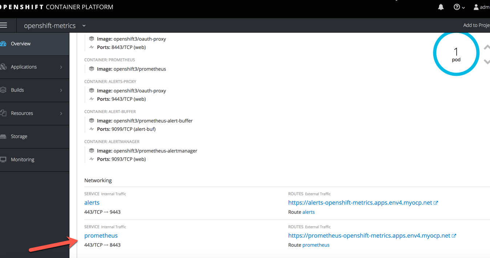

## Install Prometheus

OpenShift is installed using a collection of Ansible playbook
Your OpenShift environment is currently provisioned without Prometheus, an Open Source monitoring and time series collection system

In this lab, you will use one of the Ansible Playbook provided with OpenShift 3.7 to install and configure Prometheus for your environment.

Your environment includes the following VMs:

* An OpenShift Master
* An OpenShift Application Node
* A Bastion where ansible and the playbooks are installed.

##### Step 1 - Connect to Bastion using SSH

The lab instructor will provide keys and IP information

##### Step 2 - Inspect the Ansible Host file.

The ansible host file described all the variables and configuration of your currently installed environment.
It is divided in several sections:

* variables
* node configuration
* master configuration


##### Step 3 - Install Prometheus.
In the variables section, look for the following entry:
openshift_hosted_prometheus_deploy=false

Using your favorite text editor, change to:
openshift_hosted_prometheus_deploy=true
and save.

Run the Ansible playbook to install Prometheus:

```
ansible-playbook -v -i openshift_inventory.cfg /usr/share/ansible/openshift-ansible/playbooks/byo/openshift-cluster/openshift-prometheus.yml
```


##### Step 4 - Validate installation

In your OpenShift Console, navigate to the openshift-metrics project.

Click on the Prometheus link URL. You should be able to login to the Prometheus console and create graph


