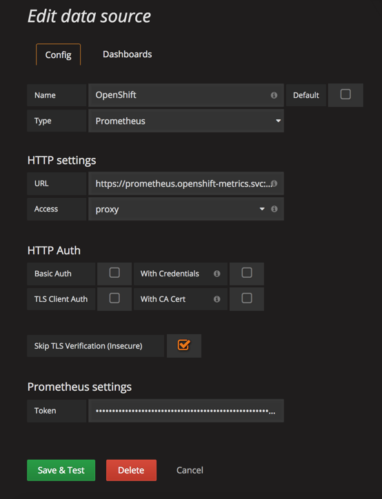
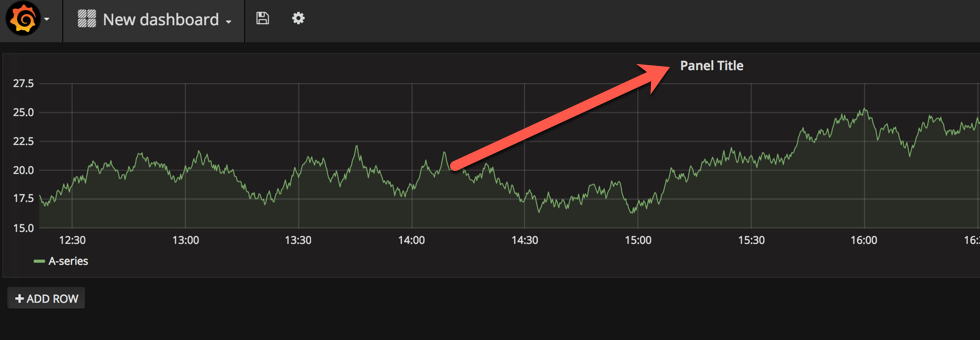
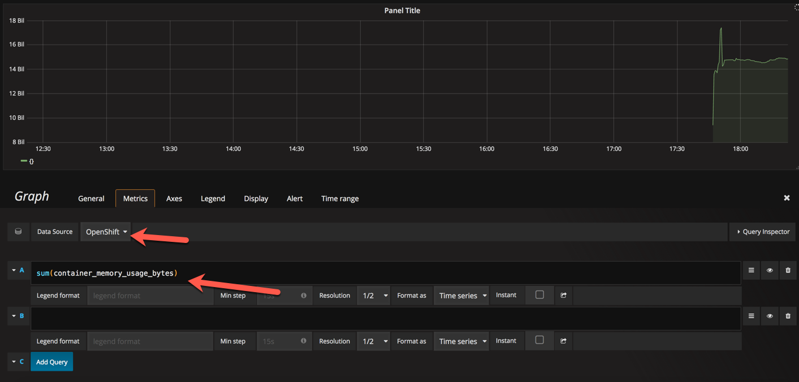

## Install Prometheus

OpenShift is installed using a collection of Ansible playbook
Your OpenShift environment is currently provisioned without Prometheus, an Open Source monitoring and time series collection system

In this lab, you will use one of the Ansible Playbook provided with OpenShift 3.7 to install and configure Prometheus for your environment.

Your environment includes the following VMs:

* An OpenShift Master
* An OpenShift Application Node
* A Bastion where ansible and the playbooks are installed.

##### Step 1 - Connect to Bastion using SSH

The lab instructor will provide keys and IP information

##### Step 2 - Inspect the Ansible Host file.

The ansible host file described all the variables and configuration of your currently installed environment.
It is divided in several sections:

* variables
* node configuration
* master configuration


##### Step 3 - Install Prometheus.
In the variables section, look for the following entry:
openshift_hosted_prometheus_deploy=false

Using your favorite text editor, change to:
openshift_hosted_prometheus_deploy=true
and save.

Run the Ansible playbook to install Prometheus:

```
ansible-playbook -v -i openshift_inventory.cfg /usr/share/ansible/openshift-ansible/playbooks/byo/openshift-cluster/openshift-prometheus.yml
```


##### Step 4 - Validate installation

In your OpenShift Console, navigate to the openshift-metrics project.

Click on the Prometheus link URL. You should be able to login to the Prometheus console and create graph


##### Step 5 - Grafana

In this section, we will take a Grafana image from the community and deploy it to OpenShift.
Grafana is a widely used data visualization tool and has a nice integration with Prometheus

Create a grafana project in OpenShift
```
oc new-project grafana
```

Deploy Grafana from a templates
```
oc new-app -f https://raw.githubusercontent.com/mrsiano/openshift-grafana/master/grafana-ocp-oauth.yaml
```

Wait for Grafana to come up, it may take a few minutes.

```
oc get pods
```

```
NAME                           READY     STATUS    RESTARTS   AGE
grafana-ocp-4149771542-f69q4   2/2       Running   0          22m
```

In the Grafana UI, configure Prometheus connectivity - replace X with your environment id

```
https://grafana-ocp-grafana.apps.envX.myocp.net
```

Create a data source with the following values:



```
Name: openshift
Type: Prometheus
URL: https://prometheus.openshift-metrics.svc:443    - Prometheus Kubernetes network service internal host name
Skip TLS Verification (Insecure):  checked - We are not using a trusted certificate
Token: see 7_Binary_Deployment_of_a_war_file
```

Token: this is an authorization to connect to Prometheus. The token is typically a service account with enough privileges to view cluster wide metrics.
The value can be obtained using the following command:

```
oc sa get-token management-admin -n  management-infra
```

Save and validate your DataSource

Next, we will create a dashboard in grafana:

In the Dashboard creation screen, add a graph and click on the panel title:



Edit the datasource and metric you want to display:




Congratulations!, You have created your first Grafana Dashboard.
Experiment with the options, queries and metrics to create additional visualization of your Cluster health and state.
